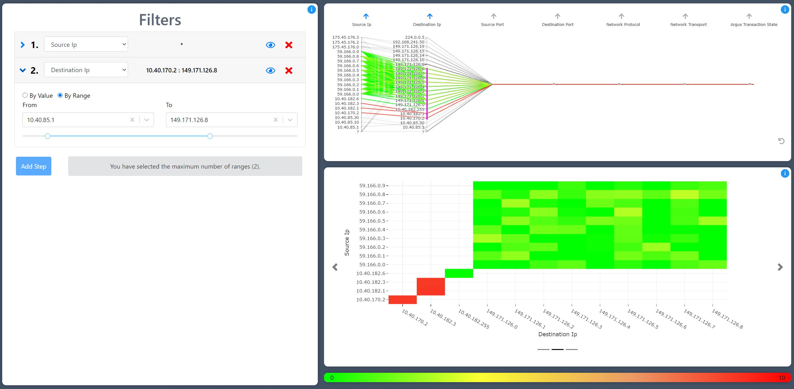
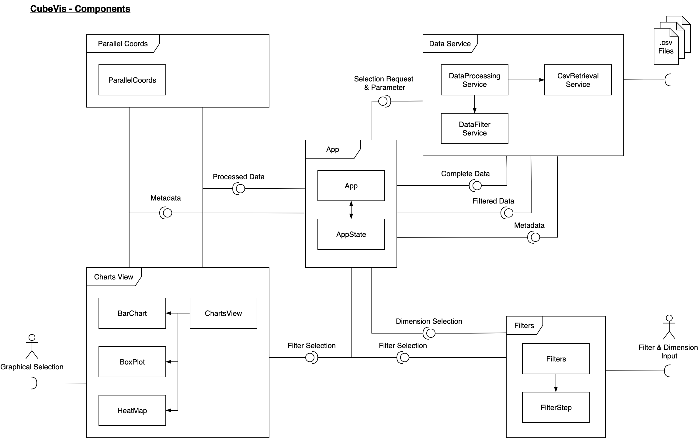
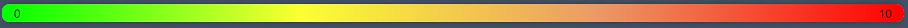
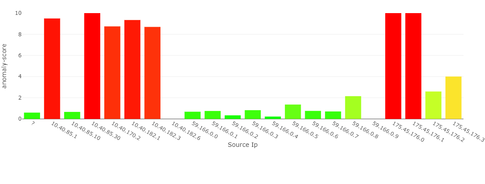
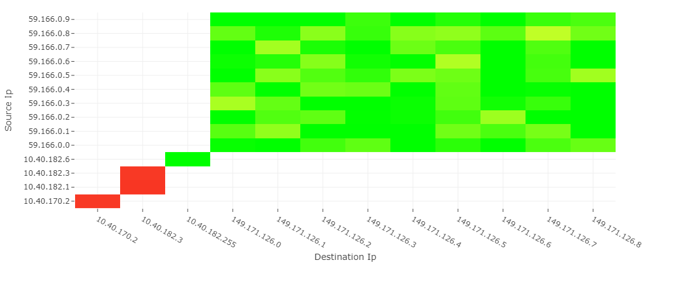
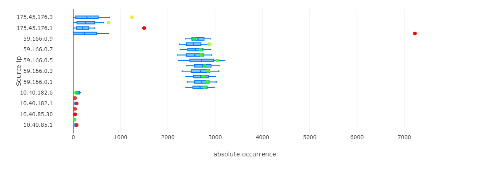
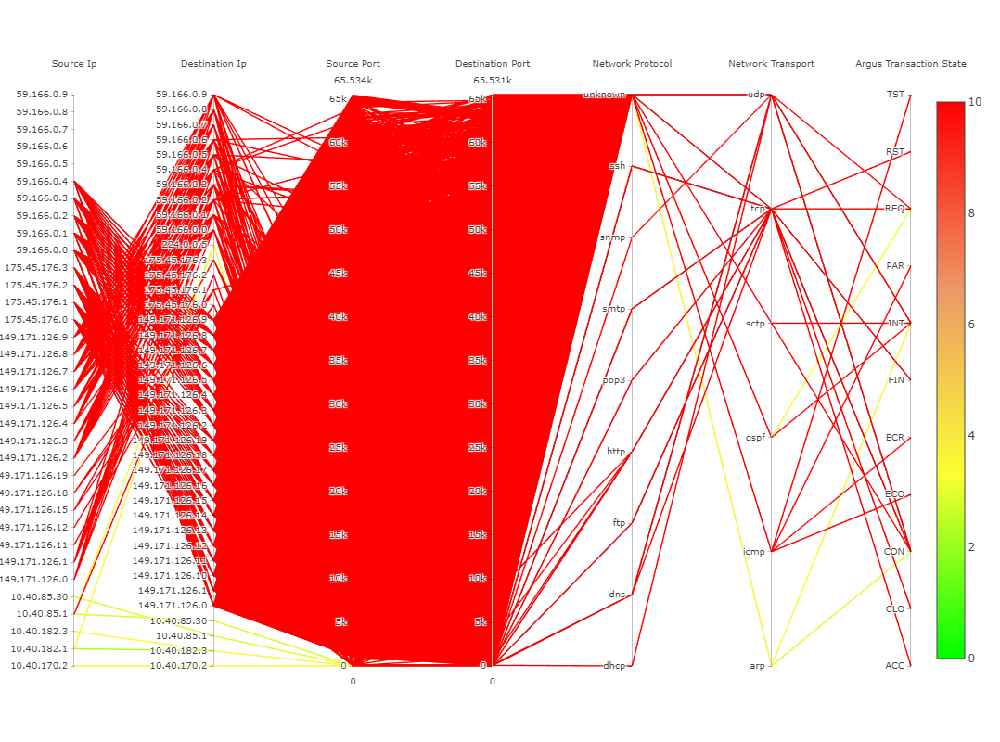
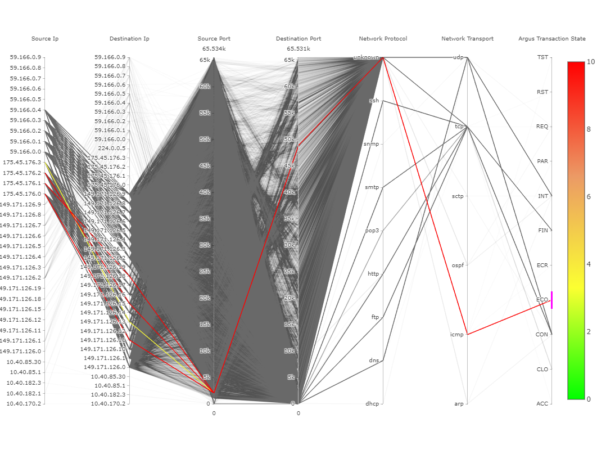
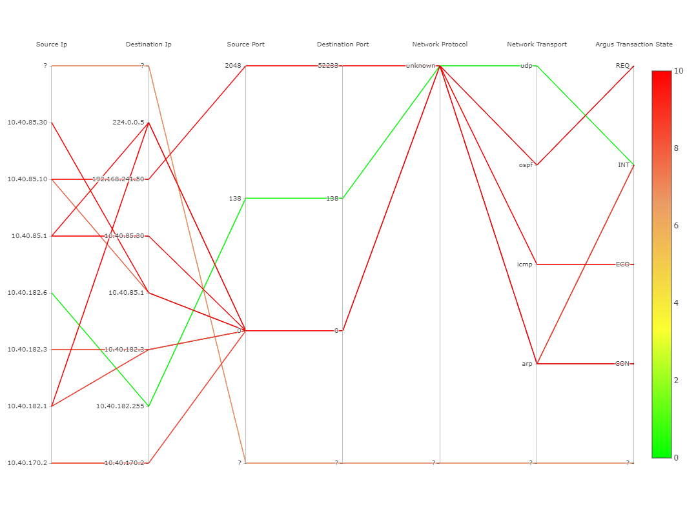
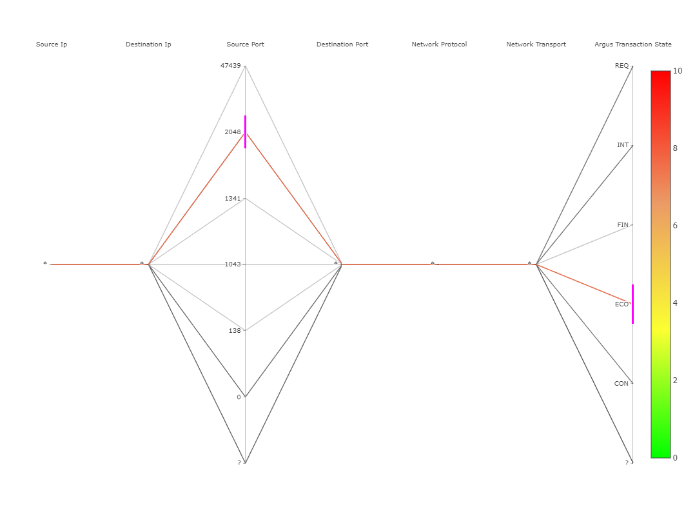

# Master Project Visualization of Data Cubes for Anomaly Detection in Security Data Streams

**Collaborators:**
- Badenhop, Jannik
- Bublitz, Marvin
- Duprat, Rémi
- Kirch, Eike
- Senge, Maximilian
- Schlenk, Darwin
- Ottlik, Manuel

# Documentation

This documentation contains information of things we found worthy to mention in some kind of documentation. It is by no means a complete description of the application or a guide on how to use it as an enduser. Instead, its goal is to explain everything that is not self explanatory by the code itself, gives partial insights in the descision process throughout the project and enable future developments to happen as easily as possible.

**Caution:** Links might not work as expected in the compiled pdf versions. For the full experience, take a look at the docs in the [repository](https://github.com/manuelottlik/hsh-cubevis-frontend/tree/main/docs). There you can see even more details concerning our decision process in the issues and pull requests.

## Table of Contents
- [Master Project Visualization of Data Cubes for Anomaly Detection in Security Data Streams](#master-project-visualization-of-data-cubes-for-anomaly-detection-in-security-data-streams)
- [Documentation](#documentation)
	- [Table of Contents](#table-of-contents)
	- [Overview](#overview)
	- [Dataflow](#dataflow)
		- [Data origin](#data-origin)
		- [Data propagation to child components](#data-propagation-to-child-components)
		- [Dataflow between child components](#dataflow-between-child-components)
	- [Data-Service](#data-service)
		- [Config file structure](#config-file-structure)
		- [How to add a new dimension](#how-to-add-a-new-dimension)
	- [Filters](#filters)
	- [Selected visualization techniques](#selected-visualization-techniques)
		- [Coloring Scheme](#coloring-scheme)
		- [Parallel Coordinates](#parallel-coordinates)
		- [Charts View](#charts-view)
	- [Impacts of the iceberg data model on the parallel coordinates diagram](#impacts-of-the-iceberg-data-model-on-the-parallel-coordinates-diagram)
		- [Comparison](#comparison)
			- [Full Model Cube](#full-model-cube)
				- [Pros](#pros)
				- [Cons](#cons)
			- [Iceberg Model Cube](#iceberg-model-cube)
				- [Pros](#pros-1)
				- [Cons](#cons-1)
		- [Result of the discussion](#result-of-the-discussion)
	- [Possible Extensions](#possible-extensions)
		- [Add hierarchies within dimensions](#add-hierarchies-within-dimensions)
		- [Display all entries of all cubes in parallel coordinates](#display-all-entries-of-all-cubes-in-parallel-coordinates)
		- [Use a 3D Scatter Plot](#use-a-3d-scatter-plot)
		- [Use state management](#use-state-management)
		- [Auto open new step when it is added](#auto-open-new-step-when-it-is-added)
		- [Eye should disable all elements of FilterStep, except (un)folding](#eye-should-disable-all-elements-of-filterstep-except-unfolding)
		- [Auto open new step when it is added](#auto-open-new-step-when-it-is-added)
		- [Eye should disable all elements of FilterStep, except (un)folding](#eye-should-disable-all-elements-of-filterstep-except-unfolding)

<div style="page-break-after: always"></div>

## Overview



## Dataflow

This document describes the pattern this software follows to let data flow between different components.


This is limited so that the graphs can visualize the data properly.

<div style="page-break-after: always"></div>

### Data origin

The data is currently served from csv files that are checked in the repository and provided to the React components via the data service.
The architecture of the data service supports switching the origin of the data from local csv files to something like an API whitout impacting the rest of the application.
To find out more about the exact configuration and further details check out the [data service documentation](data-service.md).

### Data propagation to child components

Once the data is retrieved by the data service, it is available to the React components. The chosen architecture has **one** main component (`App`) that takes care of retrieving the data from the data service. From there on it is passed to the child components via React props. These child components are `Filters`, `ChartsView` and `ParallelCoords`. Those components get mainly three props that are propagated: `data` being the full cube, `filteredData` being the current cube selected and filtered and `metadata` providing information about available dimensions, its values etc. When there is a filter added in `Filters` is added, the component emits an event that `App` listens to and adapts the `filteredData` which automatically causes all child components depending on it to rerender accordingly.

So far, this pattern follows the best practice of dataflow between components recommended by React.

<div style="page-break-after: always"></div>

### Dataflow between child components

When it comes to dataflow between child components things get a little more complicated though. The use case in this application is the following: Whenever a chart in `ChartsView` is clicked, a filter should be added. For this to happen, `ChartsView` has to communicate with `Filters` – both are children of `App` though. Usually, this is the place for state management to step in (see [possible extensions](possible-extensions.md) for more info). Since this was the only use case for state management we decided to go with the less popular, but straightforward alternative, that is recommended for minimalistic use cases like this one. This is what happens: when a chart is clicked, `ChartsView` emits a (set of) filter(s) to `App` as an event. `App` stores this in its state and propagates it to `Filters` via a prop. `Filters` is listening for changes on the prop and creates / updates the filter(s). Immediately after changing the prop `App` sets it to `null` again to be ready for the next event emitted by `Filters`.

## Data-Service

The data-service provides the functionality to load the data (e.g. cuboids in .csv files) as well as filter and sort mentionted data.

To ensure extensibility, the structure of the dimensions is configurable in a separate file: `dataservice.config.js`

### Config file structure

The `dataservice.config.js` currently has 3 properties: `configDataMapping, filePathPattern, filePaths`.

The structure is like this:
```javascript
export const configDataMapping = [
	{
		cellProperty: 'destinationIp',
		cellType: CellTypes.DESTINATION_IP,
		dimLabel: 'Destination Ip',
		dimName: 'destination.ip',
		dataType: DataType.IP,
		orderInFile: 0,
	},
	... // one object for each dimension
];

export const filePathPattern = {
	prefix: '(',
	appendix: ').csv',
	separator: ', ',
	notIncludedFlag: '_',
};
```

<div style="page-break-after: always"></div>

```javascript
export const filePaths = {
	countFilePath: '/data/checkpoints/epoch_0/',
	countFileName: 'cell_models.csv',
	anomalyFilePath: './data/estimates/epoch_0/full_anomaly_cube/',
	singleCountFilePath: './data/validation_data/epoch_0/batch_0/item_0_sub_item_0/',
};
```

`configDataMapping` is an array which consists of data-mapping objects which do have the following attributes:

- `cellProperty`: the name of the cell property found in `src/models/cell.model.ts`. To add a new dimension it is necessary to add a new field with the same name in said file. So if the value in `cellProperty` is `sourceIp`, there has to be a `sourceIp` property in `cell.model.ts`.
- `cellType`: The celltype property maps the internally used enum to the dimension. To add a new dimension, an additional entry in the enum is necessary.
- `dimLabel`: The label which should appear in the application for this dimension.
- `dimName`: Name of the column in the csv file which represents this dimension.
- `dataType`: The datatype of this dimension. This is needed for differentiating in the diagrams. There are currently four data types: `NUMERIC`, `NOMINAL`, `IP`, `ORDINAL`. 
- `orderInFile`: The order when the name in filename appears starting at 0. Example filename: "(source.ip, destination.ip, source.port, destination.port, network.protocol, network.transport, Argus.transaction.state).csv" for source.ip the order would be 0, destination.ip 1 etc.

`filePathPattern` Describes the pattern how the csv files are structured (assuming there is one distinct csv file per cuboid). The following attributes are being used:

- `prefix`: The characters which the file starts with.
- `appendix`: The characters which the file ends with including the file extension.
- `separator`: Characters which separates the dimensions in the filename. Isn't applied for the last dimension.
- `notIncludedFlag`: Character which equals a *, so a not included dimension.

`filePaths` consists of different filepaths which are needed to parse the data. The data files should be located in the `public/data`-folder.

- `countFilePath`: Filepath for the folder which contains the count-values.
- `countFileName`: Name of the file which containts the count-values.
- `anomalyFilePath`: Filepath for the folder which contains the anomaly-values.
- `singleCountFilePath`: Filepath for the folder which containts the validation-data.

<div style="page-break-after: always"></div>

### How to add a new dimension

To add a new dimension to the dataservice, there are multiple files which have to be changed. Namely:
- `src/models/cell.model.ts`
- `src/enums/cellTypes.enum.ts`
- `dataservice.config.js`

First of all, the new name of the dimension has to specified in the `src/models/cell.model.ts` file as well as in here: `src/enums/cellTypes.enum.ts`, so it can be accessed as type.

The only thing left is to add a new object to the `configDataMapping` array in the `dataservice.config.js` using the schema explained above. For anomaly scores it is assumed that there is a file for each possible cuboid. The new dimensionname has to appear in the filename, so it can be parsed correctly.

If the filename-pattern changes, the `filePathPattern` property has to be adjusted as well. And that's all! The new dimension should now appear in the application.

## Filters

The filtering is done in steps, to enable the user to retrace his steps and keep a good overview.
In each step one of currently seven dimensions is chosen and one or more values can be selected. To make these selections more comfortable, the user can also select a range of values.
The logic of the filters is seperated into a managing component (Filters.tsx) with mostly logic and a visual component with mostly ui management (FilterSteps.tsx).

The FilterSteps maintains a State that each manages one filter, while the Filters component keeps a list over all of the steps and provides the necessary onChange methods.
The Filters component then parses these observed filters into a FilterParameter and passes it on to its own onChange handler, provided by the App.tsx.
It is also responsible to only let the users take valid actions, such as limiting him to only n (currently 2) "loose" filters. A loose filters is one that selects more than a single value.
This is limited so that the graphs can visualize the data properly.

<div style="page-break-after: always"></div>

## Selected visualization techniques

This section provides a brief overview of why we chose each visualization technique.


### Coloring Scheme



The central metric of the visualized data is the "anomaly score". The anomaly score is defined as the number of standard deviations the actual count deviates from the model mean. `0.0` means that the record is most likely not an anomaly, where `10` is most likely an anomaly. The color mapping tries to visualize anomaly values in between.


### Parallel Coordinates

The parallel coordinate system is one of the few ways to represent multidimensional data in a meaningful way. By coloring each line of the chart, it is additionally possible to see groupings or patterns in the data. Therefore, on the one hand, the parallel coordinate system is intended to provide an overview of the data, but on the other hand, it is also intended to be a decision-making aid for the selection of suitable filters.

Since the range of functions of the parallel coordinates was only partially sufficient, along each axis still another button was implemented for ascending and/or descending sorting.

Due to the iceberg condition, the effect we hoped for from the parallel coordinates is only partially effective. Details of this problem are documented [here](parcoords-comparison.md).

### Charts View

The main advantage of the charts view is the extensibility. It is possible to create a new visualization component and add it to the charts view. A fourth page in the slider view will be created automatically.

-	**Bar chart**: The bar chart gives a good overview of the distribution of anomaly values for a single dimension.
	
-   **Heat Map**: A heat map is useful to contrast two dimensions and additionally represent the anomaly value by a color scale. Humans have trouble visually processing more than two dimensions - so we opted for a two-dimensional representation. By using the filter step view it is possible to switch between the dimensions.
	
-   **Box Plot**: In contrast to the bar chart or the heat map, the boxplot chart does not (only) show the relative anomaly scores, but the absolute measured values. The center of the box represents the expected reference value from the training data, while the box shows the calculated standard deviation. The twofold standard deviation is enclosed by the whiskers. The colored dot represents the real measured count of the specific cuboid cell. The color here shows the anomaly score, which is formed by the count of standard deviations from the reference value shown in the plot.
	

<div style="page-break-after: always"></div>

## Impacts of the iceberg data model on the parallel coordinates diagram

The v2 data differs from the data that was provided in the beginning of the project (v1). The difference is that v2 has an iceberg model applied to the data, so entries that occourd in a small cuboid might not be in the base cuboid. This requires the parallel coordinates to use differen cuboids whenever a new filter is added. The impact can be seen in the comparison of the following screenshots. **See at the end of this page to see the result of the discussion.**

[this issue contains additional information](https://github.com/manuelottlik/hsh-cubevis-frontend/issues/40)

### Comparison

The following screenshots can display the difference of the two data sets:

#### Full Model Cube

The chart always displays the same cube: the full cube. When filters are chosen, entries not matching the filter are greyed out.





##### Pros

- visualizes past decisions
- can help to choose the next filter

##### Cons

- more cluttered
- less performant

#### Iceberg Model Cube

Shows the cube containing all dimensions that have existing filters. When a filter is added, a new cube with different entries is loaded. Has to use stars for dims that do not have a filter applied yet.




##### Pros

- visualizes past decisions
- (less cluttered)

##### Cons

- confusing, because with each filter, other values appear on the dim axis'
- too few entries
- can not support future decisions as dims without filters are not present


### Result of the discussion

As discussed by Tim Laue and Felix Heine, using different cuboids is not a problem and still provides benefit for the user. Felix Heine proposed to display all entries of all csv files including its stars, but this concept is yet to be discussed and will be listed as a [possible extension](possible-extensions.md). For now, it is out of scope for this project.

Further comments can also be seen at the issue mentioned earlier.

## Possible Extensions

This documents features a few possible extensions to the project after CubeVis master project.

### Add hierarchies within dimensions

In a dimension there could be internal hierarchies that group values of a dimension by some kind. A very obvious example would be to group IPs by their bytes. A more sophisticated idea, that also needs additional data is the grouping of IPs by their origin, for example a country or state. Given these hierarchies, there could be filters applied to the data in respect to the internal groups. Since these hierarchies are not present in the data yet it was not in the scope of the final product.

### Display all entries of all cubes in parallel coordinates

In regards to the issue stated in the [comparison of the data with our without the iceberg model](parcoords-comparison.md) there was the idea by Felix Heine to display all entries of all cuboids in the parallel coordinates diagram in order to provide the maximum amount of information. Since this approach is not yet verified by GLACIER it was not in the scope of the final product.

### Use a 3D Scatter Plot

To allow even more dimensions to be shown a 3D scatter plot could be implemented. This would allow the user to set a range of values or no filtering at all for the last three steps in the step view. Since it is not very easily to read it was not in the scope of the final product.

### Use state management

When propagating filter events from ChartsView up to the App component and then down to the Filters component, using a state management system for filters seems more appropiate. Since this was the only occourence in the project where state management it was not worth it to include it in the final product.

###  Auto open new step when it is added 

When a user creates a new step, he probably wants to set its filter right away. So it would be more comfortable if the step were to open when it is added.
This is however not a critical feature and came up very late during development.

###  Eye should disable all elements of FilterStep, except (un)folding

The eye button sets a "disabled" state to the FilterStep, but the elements are mostly just drawn as disabled and can still be used. I.e.:
- deleting a Step
- changing a Step
This may confuse the user.
This is once again not a critical feature and also came up very late during development.
