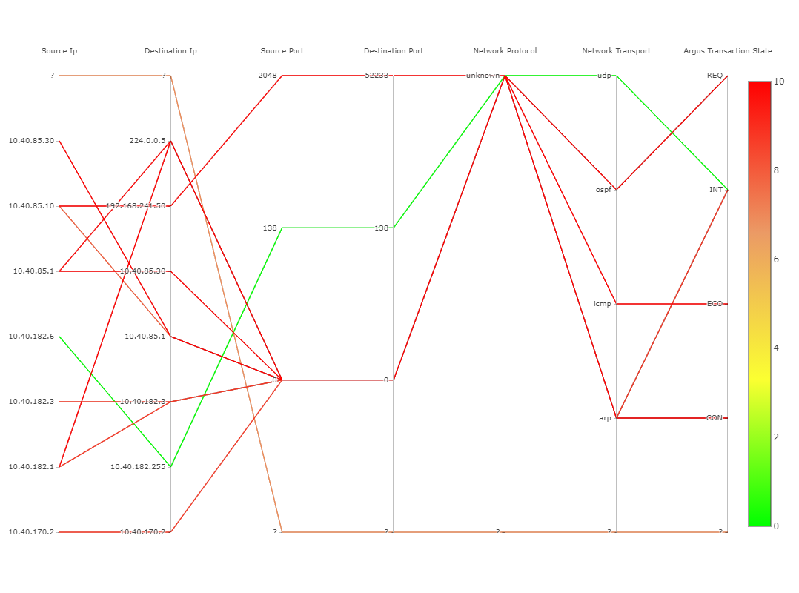

# Impacts of the iceberg data model on the parallel coordinates diagram

The v2 data differs from the data that was provided in the beginning of the project (v1). The difference is that v2 has an iceberg model applied to the data, so entries that occourd in a small cuboid might not be in the base cuboid. This requires the parallel coordinates to use differen cuboids whenever a new filter is added. The impact can be seen in the comparison of the following screenshots. **See at the end of this page to see the result of the discussion.**

[this issue contains additional information](https://github.com/manuelottlik/hsh-cubevis-frontend/issues/40)

## Comparison

The following screenshots can display the difference of the two data sets:

### Full Model Cube

The chart always displays the same cube: the full cube. When filters are chosen, entries not matching the filter are greyed out.

#### Pros

- visualizes past decisions
- can help to choose the next filter

#### Cons

- more cluttered
- less performant

### Iceberg Model Cube

Shows the cube containing all dimensions that have existing filters. When a filter is added, a new cube with different entries is loaded. Has to use stars for dims that do not have a filter applied yet.

#### Pros

- visualizes past decisions
- (less cluttered)

#### Cons

- confusing, because with each filter, other values appear on the dim axis'
- too few entries
- can not support future decisions as dims without filters are not present

## Result of the discussion

As discussed by Tim Laue and Felix Heine, using different cuboids is not a problem and still provides benefit for the user. Felix Heine proposed to display all entries of all csv files including its stars, but this concept is yet to be discussed and will be listed as a [possible extension](possible-extensions.md). For now, it is out of scope for this project.

Further comments can also be seen at the issue mentioned earlier.
