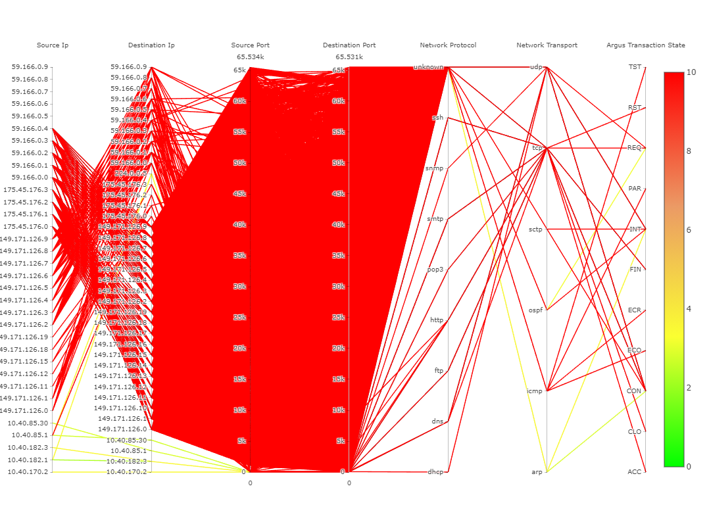

# Impacts of the iceberg data model on the parallel coordinates diagram

[this issue contains additional information](https://github.com/manuelottlik/hsh-cubevis-frontend/issues/40)

## Full Model Cube

The chart always displays the same cube: the full cube. When filters are chosen, entries not matching the filter are greyed out.

### Pros

- visualizes past decisions
- can help to choose the next filter

### Cons

- more cluttered
- less performant

## Iceberg Model Cube

Shows the cube containing all dimensions that have existing filters. When a filter is added, a new cube with different entries is loaded. Has to use stars for dims that do not have a filter applied yet.

### Pros

- visualizes past decisions
- less cluttered

### Cons

- confusing, because with each filter, other values appear on the dim axis'
- too few entries
- can not support future decisions as dims without filters are not present
